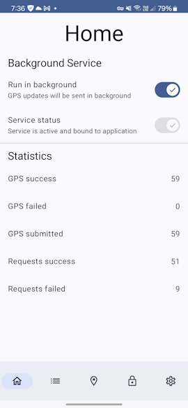
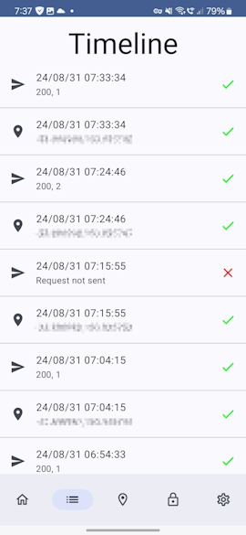
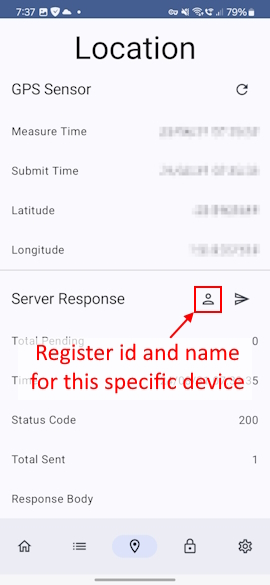
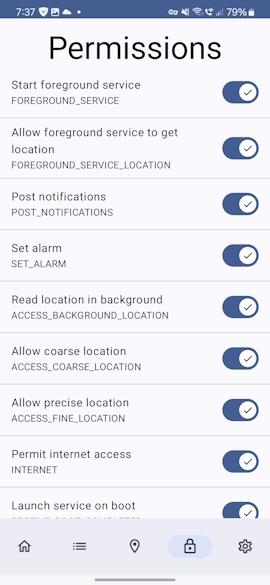
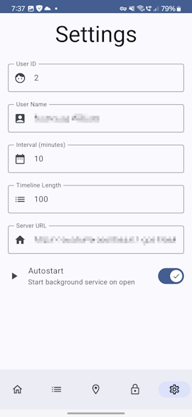

# Introduction
A free and open source Android GPS tracking app that leverages Google cloud for free and secure personal hosting. Refer to ```SETUP.md``` for instructions on how to setup the project on your own Google cloud account and install the Android app.

## Features
- Store and track as many phones as you want.
- Store as many data points as you want into your Google cloud datastore.
    - Free tier is offered by Google which allows up to 1GB .
    - 2.5K data points takes up 1MB.
    - Around 2.5 million data points for free.
    - Around $0.2/GB/month when above 1GB free tier limit.
- GPS data is stored securely on your own Google cloud project and accessible only to your Google account.
- Android app will keep a timeline of all GPS locations every specified interval.
    - Handles network or internet dropouts by storing history of locations while disconnected.
    - Will upload all of these stored GPS locations once internet is available to ensure no gaps in GPS path.
    - Can be installed on as many Android devices as you want.

# Gallery
## Android App
1. Set the ```user_id``` and ```user_name``` in the settings screen.
2. After you have setup your Google cloud server endpoints copy the URL to the settings screen.
3. Register phone by going to the ```location``` screen and pressing the user icon (Refer to screenshot).






## GPS Plotting website


## Third party GPS Visualiser website
- You can export the GPS data and visualise it on any GPS visualisation website
- [GPS_Visualiser](https://www.gpsvisualizer.com/map_input?form=html&format=google).
- Refer to ```/datastore/README.md``` for instructions on exporting data for above website.

