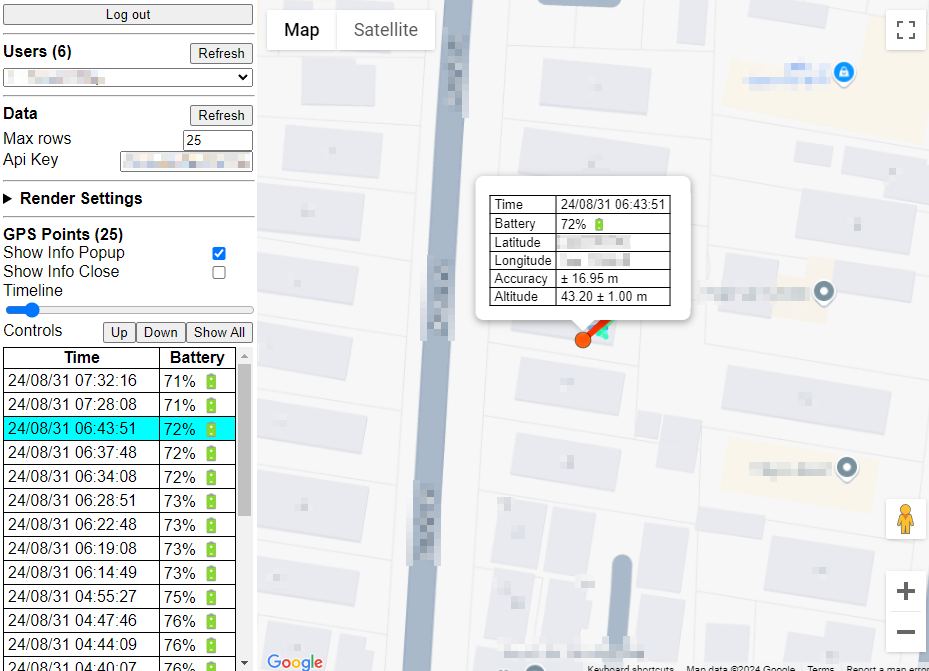

# Local development
## 1. Setup gcloud
1. Create project at: ```https://console.cloud.google.com/```.
2. Install gcloud.
3. Initalise gcloud: ```gcloud init```.
4. Create local authentication credentials for user account: ```gcloud auth application-default login```.
5. **(IMPORTANT)** Setup environment variables: ```./setup_env.sh```.

## 2. Setup python environment
1. Setup virtual environment: ```py -m venv venv```.
2. Activate virtual environment: ```source ./venv/*/activate```.
3. Install requirements: ```pip install -r requirements.txt```.

## 3. Performining initial setup
- Refer to ```/cloud_functions``` and ```/datastore``` for initial setup and deployment.

## Links to gcloud admin console
- [Cloud functions](https://console.cloud.google.com/functions/list)
- [Datastore](https://console.cloud.google.com/datastore/databases/-default-/)

# Plotting track with website
1. Enable [Google maps API](https://console.cloud.google.com/marketplace/product/google/maps-backend.googleapis.com).
2. Copy the api key into the visualiser when it prompts for it.

## Serving website from gcloud 
1. Go to dashboard: [Cloud functions](https://console.cloud.google.com/functions/list)
2. Get URL for ```/visualise_tracks/``` endpoint.

## Deploying website locally
1. Start local test server: ```python ./cloud_functions/test_local.py```.
2. Open visualiser: [Local URL](http://localhost:5000/visualise_tracks/)



# Plotting track with GPS Visualiser
## Download track data
1. Download datastore as csv: ```python ./datastore/export_datastore.py```.
2. Convert to track format: ```python ./datastore/convert_to_track_format.py```.

## Upload track data
1. Enable [Google maps API](https://console.cloud.google.com/marketplace/product/google/maps-backend.googleapis.com).
2. Make sure there are no restrictions to referall URL or usage type.
4. Upload converted track csv to [GPS_Visualiser](https://www.gpsvisualizer.com/map_input?form=html&format=google).
5. (Optional) Copy Google maps api key.
6. Setup options according to screenshot.
7. Press ```Draw the map```.

### Options


### Viewer

