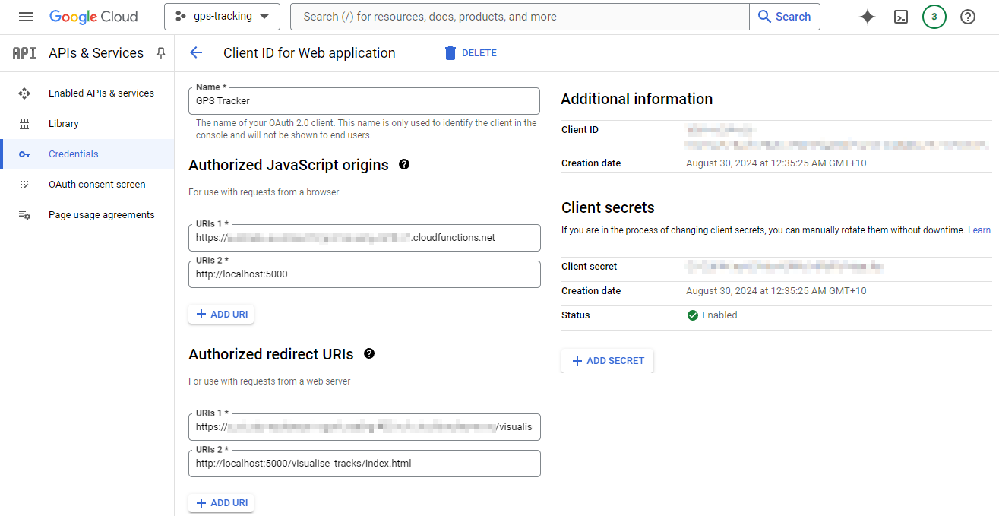
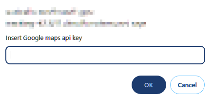
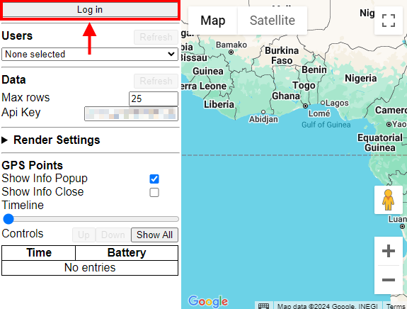
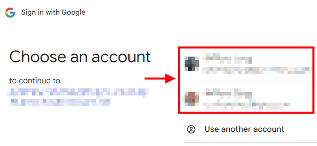
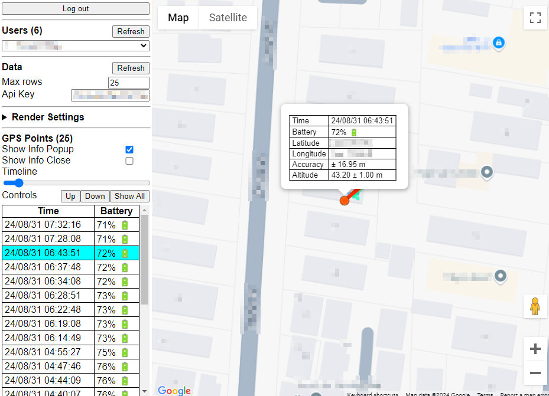
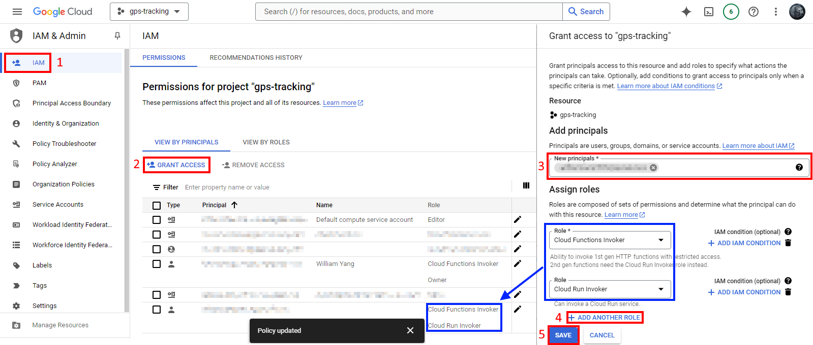

# Introduction
- Cloud functions for serverless endpoints. 
- This requires setting up the Firebase datastore in Google cloud first.

## Commands
| Description | Command |
| --- | --- |
| Deploy function/s to gcloud | ```python ./deploy_function.py``` |
| Test functions locally | ```python ./test_local.py``` |
| Submit gps sample to server | ```python ./post_gps.py``` |
| Register username | ```python ./post_user_name.py <id> <name>``` |

## Performining initial setup
1. Create oauth2 consent screen: [OAuth2 Consent Screen](https://console.cloud.google.com/apis/credentials/consent)
2. Create oauth2 client id: [OAuth2 Credentials](https://console.cloud.google.com/apis/credentials)
    - Create an OAuth 2.0 client id.
    - Copy the client id and client secret values into your ```setup_env.sh``` file. Refer to ```example_setup_env.sh```.
3. Select the region where you want your website to be served from
    - Pick a region from [Available regions and zones](https://cloud.google.com/compute/docs/regions-zones#available).
    - If it is prefixed with ```a,b,c,...``` ignore it.
    - Copy the zone/region string to your ```setup_env.sh``` file. Refer to ```example_setup_env.sh```.
4. Enable cloud functions api in dashboard: [Cloud Functions](https://console.cloud.google.com/functions/list).
5. Deploy all functions to gcloud: ```python ./deploy_function.py```.
    - If you encounter missing environment strings then make sure you run ```source ./setup_env.sh``` in a bash shell.
6. Add the base URL of your cloud functions to oauth2 client id (step 2)
    - Javascript origin: ```https://[YOUR_CLOUD_FUNCTION_URL]```
    - Redirect uri: ```https://[YOUR_CLOUD_FUNCTION_URL]/visualise_tracks/index.html```
7. Enable [Google maps API](https://console.cloud.google.com/marketplace/product/google/maps-backend.googleapis.com).
    - Copy the api key down for future use in the visualiser webpage.



## Opening deployed website
1. Go to [Cloud Functions](https://console.cloud.google.com/functions/list).
2. Get the URL for ```/visualise_tracks``` endpoint.
3. Go to ```https://[YOUR_CLOUD_FUNCTION_URL]/visualise_tracks/index.html```.
4. Enter the Google maps javsacript api key into the prompt.
5. Press the ```Log in``` button in the top-left corner.
6. Select the Google account associated with the gcloud project and sign in.
    - Consent form generates an authorization code.
    - Authorization code is sent to endpoint ```/oauth2_id_token``` to get id token.
    - OAuth2 id token is used to authorize access to restricted GPS server endpoints.






## (Optional) Deploying website locally
1. Update oauth2 client id to include localhost
    - Javascript origin: ```http://localhost:5000```
    - Redirect uri: ```http://localhost:5000/visualise_tracks/index.html```
2. Start local test server: ```python ./test_local.py```.
3. Open local visualiser page: [http://localhost:5000/visualise_tracks/index.html](http://localhost:5000/visualise_tracks/index.html)

## (Optional) Adding additional accounts that can access GPS data
1. Open [IAM (Identity Access Management)](https://console.cloud.google.com/iam-admin/iam).
2. Press ```+ GRANT ACESSS``` to add a new user by email.
3. Assign the following roles:
    - Cloud Functions Invoker (Ability to invoke 1st gen HTTP functions with restricted access)
    - Cloud Run Invoker (Ability to invoke 2nd gen HTTPs functions with restricted access)
4. Wait a few minutes for the IAM policy to affect restricted cloud function endpoints.
5. Login using the newly added Google account.


