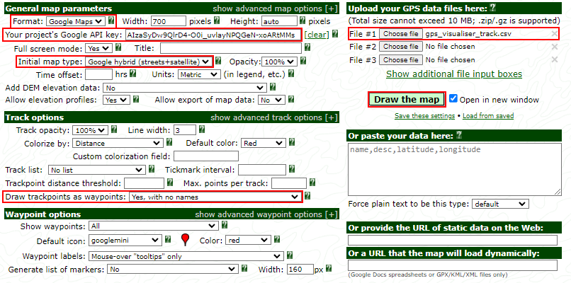

# Introduction
Google datastore configuration.

## Commands
| Description | Command |
| --- | --- |
| Update index | ```gcloud datastore indexes create ./index.yaml``` |
| Download and export datastore | ```python ./export_datastore.py``` |
| Delete rows | ```python ./delete_datastore.py``` |
| Convert to GPS Visualiser track format | ```python ./convert_to_track_format.py``` |

## Performing initial setup
1. Enable and create Firebase datastore.
    - [Datastore](https://console.cloud.google.com/datastore/databases)
    - Make sure ```Database ID``` is ```(default)``` so you can use free tier.
2. Update database index: ```gcloud datastore indexes create ./index.yaml```

# (Alternative) Plotting track with GPS Visualiser
Instead of using the visualiser website we can export data for third party apps.

1. Download datastore as csv: ```python ./export_datastore.py```.
2. Convert to track format: ```python ./convert_to_track_format.py```.
3. Open [GPS_Visualiser](https://www.gpsvisualizer.com/map_input?form=html&format=google)
4. Get a Google maps javascript api key
    - Enable [Google maps API](https://console.cloud.google.com/marketplace/product/google/maps-backend.googleapis.com).
    - Make sure there are no restrictions to referall URL or usage type.
    - Copy the key into the options page.
5. Upload converted track csv.
6. Setup options according to screenshot.
7. Press ```Draw the map```.

### Options


### Viewer

